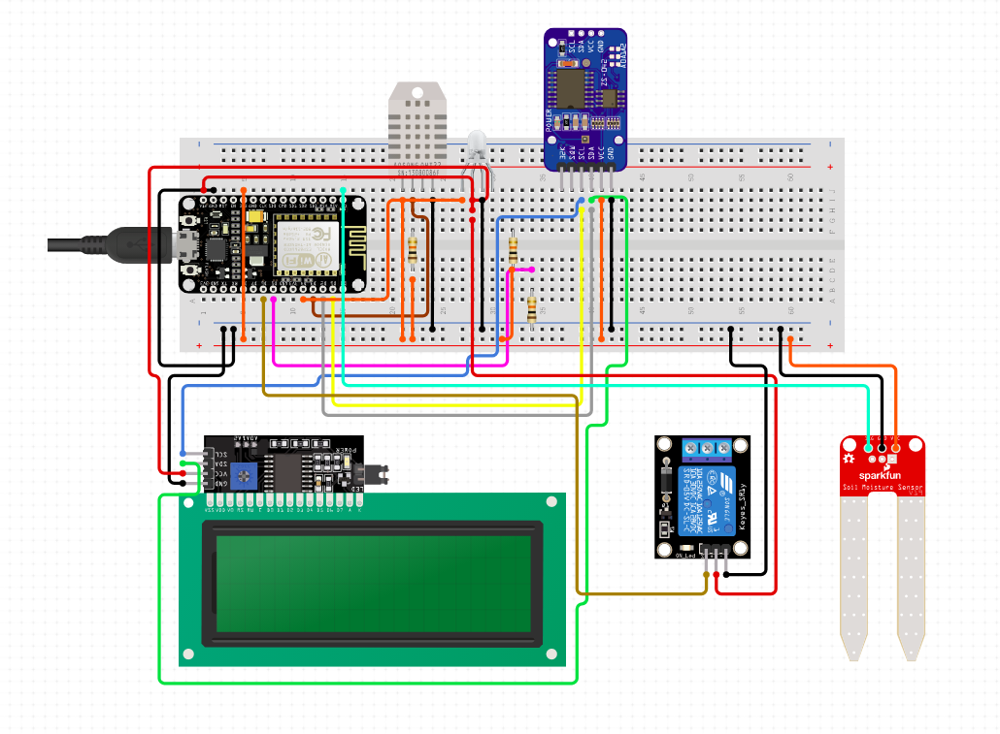
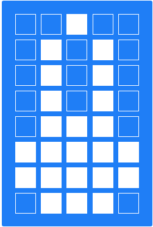

# ArduinoTaskScheduler (Automatický zavlažovač skleníku)

> Zdrojové soubory k projektu jsou uloženy na Github [repozitáři projektu](https://github.com/tomas-dostal/ArduinoTaskScheduler) 

Cílem této semestrální práce je vytvořit kompletní řešení pro automatické zavlažování skleníků. V souvislosti s tím bych chtěl vytvořit/upravit  plánovač, který by byl jednoduše rozšiřitelný a upravitelný a použitelný i v dalších mých projektech. 

## Možnosti plánování

- jednorázově sepnout daný výstup A po dobu X vteřin
- jednorázově sepnout daný výstup A po dobu X vteřin na základě nějaké vnější události (např. stisk tlačítka, teplotní senzor, světelný senzor) 
- opakovaně spínat daný výstup A po dobu X vteřin s periodou Y vteřin
- Pokročilé plánování např. sepni výstup ve středu, 1. dubna 2020 v 22:00 na dobu 10 vteřin. 

## Vstupy

V projektu budu pracovat s následujícími vstupy: 

- Senzor DHT11 (teplota + vlhkost)
- Senzor vlhkosti půdy
- Tlačítko
- RTC modul DS3231


## Výstupy

- Displej 20x4 připojený přes I2C
- Notifikační LED
- Relé/tranzitor spínající čerpadlo
- (dle možností Webové rozhraní)

# Zapojení 


Vytvořeno v [Circuit.io ](https://www.circuito.io/static/reply/index.html?solutionId=5eb060397c4b880030747f86&solutionPath=storage.circuito.io)

## Seznam součátek
+ RTCNodeMCUv1.0 modul 
+ 20X4 displej I2C
+ Senzor vlhkosti a teploty DHT11
+ Relé modul 
+ Senzor vlhkosti půdy 
+ 2ks rezitor 10kOhm 
+ tlačítko 

## Přidáno následující

Oproti výchozí verzi (viz Credits) jsem provedl následující změny

+ možnost plánování pomocí data a času
+ strukturování do jednotlivých souborů pro lepší přehlednost 
+ přidání dalších možností spínání
+ přidání možnosti update (slouží například k vykreslování na displej. Mezi spuštěním např. zalévání a vypnutím je třeba několik minut. Díky update můžu na displej zobrazit současný stav, zbývající čas atd...)
+ přidání progress baru do třídy ovládající displej 

# Uživatelská čast

Kód z uživatelského hlediska funguje tak, že se v hlavním souboru *ArduinoTaskScheduler.ino* vytvářejí jednotlivé úlohy, například 

``` c 
  Temperature   temperature(TEMP_PIN,		// pin of DHT11 sensor
                TEMP_REALOAD,				// call period
               &debugger,					// debugger instance (Serial)
               &lcd);						// LCD I2C 20x4 instance 
```

Konkrétně tato úloha je rozšíření třídy TimedTask. 
Takovéto úlohy se pak podle priority vloží do pole pointerů *tasks[]

``` c 
Task *tasks[] = {
	&debugger,			// Debugger for other tasks
	&blinker,			// example for turn on - delay - turn off - delay task 
	&onetimeexecute, 	// example for one-time-run task 
	&temperature,				
	&mylcd				// LCD for other tasks
};
``` 

Součásti, které stojí za zmínku jsou **Debugger**

### Debugger 

``` c 
// Debugger:  
class Debugger : public Task
{
public:
  Debugger(); 
  void debugWrite(String debugMsg); // Used for simple debugging of other tasks 
(...) 
}
``` 

a LCD 

### LCD 

``` c
class LCD : public Task
{
public:
  LCD();
  void writeString(String text); 
  void writeLine(int index, String text);
  void writeLineFrom(int row, int index, String text);

  void drawProgressBar(int row, uint32_t var, uint32_t minVal, uint32_t maxVal);

  void writeCharTemperature(int row, int index);
  void writeCharHumidity(int row, int index);

  void clearAll(); //Used for simple debugging of other tasks
  void clearLine(int line); //Used for simple debugging of other tasks
	(...) 

};
``` 

Vytvořil jsem také sadu speciálních znaků, například 



 

a další, pro lepší orientaci v datech zobrazených na displeji. 

Displej testovacího zapojení vypadá v současnosti takto: 

 

``` c
//  |--------------------|
//  |DD:MM:SS DD:MM:RR   |
//  |#35,3°C #100%       |
//  |####Progressbar#####| 
//  |  CURRENT_STATUS ##1| status (0,15) connected clients (16,19) [ ##1], OTHERWISE status (0,19)
//  |--------------------|
``` 
# Popis fungování


Výchozí třídou je **Task**. 

``` c 
// Task.h header 
class Task 
{
public:
    virtual bool canRun(DateTime dt_now) = 0;   	// return true, if the task can run now
    virtual bool canUpdate(DateTime dt_now) = 0; 	// return true, if the task can update now
    virtual void run(DateTime dt_now) = 0;    		// setup this 
    virtual void update(DateTime dt_now) = 0; 		// setup this 
    
		// backwards compatibility
    /*
     * Can the task currently run?
     * now - current time, in milliseconds.
     */ 
    virtual bool canRun(uint32_t now) = 0;		
    /*
     * Can the task currently update (runned before)?
     * now - current time, in milliseconds.
     */ 
    virtual bool canUpdate(uint32_t now) = 0;    
   	/*
     * Run the task,
     * now - current time, in milliseconds.
     */
    virtual void run(uint32_t now) = 0;			
    virtual void update(uint32_t now) = 0;

		// to be able to differ if DateTime version is used for the task
    virtual bool isRtcTask() { return false; };

};
``` 
Z ní vychízejí třídy **TriggeredTask** , **TimedTask** a **TriggeredTimeTask**. 
S polem Tasků pak pracuje třída TaskSheduller, která je podle pořadí v poli (vstupní argument) spouští.  

``` c 
// TaskSheduler.h 

#include "Task.h"

// Calculate the number of tasks in the array, given the size.
#define NUM_TASKS(T) (sizeof(T) / sizeof(Task))

class TaskScheduler 
{

public:
    /* Create a new task scheduler.  Tasks are scheduled in priority order,
     * where the highest priority task is first in the array, and the lowest
     * priority task is the last. 
     */
    TaskScheduler(Task **task, uint8_t numTasks);
    TaskScheduler(Task **task, uint8_t numTasks, RTC_DS3231 * rtc);

    void runTasks();

private:
    Task **tasks;   // Array of task pointers.
    int numTasks;   // Number of tasks in the array.
    bool enableRTC; 
    RTC_DS3231 * rtc; 

};

``` 

V tuto chvíli používám kontruktor bez parametru RTC_DS3231, ale do budoucna jej chci nechat až jako sekundární. Jak je z úryvků kódu asi poznat, snažil jsem se o jakousi zpětnou kompatibilitu pro případ, že bych chtěl ArduinoTaskSheduller použít někde, kde není k dispozici RTC modul. Části kódu, kde se toto používá bych pak obalil do podmíněného překladu. 

Tím, že chci, aby TaskScheduler kód uměl pracovat s Tasky pracující s DateTime (navázán na RTC modul), musím si u každého Tasku pamatovat, jestli se jedná o běžný Task, nebo RTC Task (podle použitého konstruktoru).  


# Credit sekce
Myšlenka, díky které toto celé funguje, není má. Vycházel jsem z již existujících kódů, které se mi zalíbily natolik, že jsem se rozhod je upravit a rozšířit.  

Původním autorem je Alan Burlison, Copyright Alan Burlison, 2011

+ Původní [zdrojový kód](http://bleaklow.com/files/2010/Task.tar.gz)

+ odkaz na [webové stránky projektu](http://bleaklow.com/2010/07/20/a_very_simple_arduino_task_manager.html)


Autorem modifikace ze dne 17.03.2019, ze které jsem vycházel je Kevin Gagnon (@GadgetsToGrow  [osobní stránky](https://www.hackster.io/GadgetsToGrow)) 

 +  Vycházel jsem z tohoto [github projektu](https://github.com/gadgetstogrow/TaskScheduler)

Při práci jsem také použil knihovny třetích stran, nebo se někde inspiroval, jmenovitě 

 *  Adafruit library [(DHT sensor)](https://github.com/adafruit/RTClib)

 *  Adafruit  [RTClib](https://github.com/adafruit/DHT-sensor-library)

* Adafruit Unified Sensor (součást RTClib) [zde](https://github.com/adafruit/Adafruit_Sensor)

 *  LiquidCrystal_I2C [zroj](https://www.arduinolibraries.info/libraries/liquid-crystal-i2-c)

 * Display:DrawProgressBar [inspirace](https://forum.arduino.cc/index.php?topic=180678.0) 


Tento seznam nemusí být kompletní a vždy aktuální. Kompletní přehled najdete vždy v hlavičce souboru *ArduinoTaskSheduller.ino*. 


