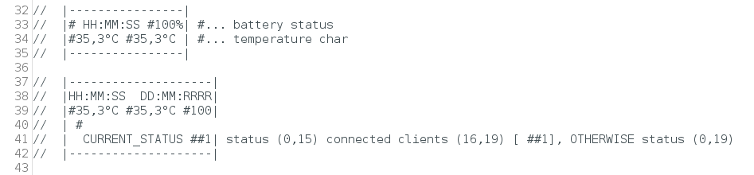

# ArduinoTaskScheduler (Automatický zavlažovač skleníku)

> Zdrojové soubory k projektu jsou uloženy na Github [repozitáři projektu](https://github.com/tomas-dostal/ArduinoTaskScheduler) 

Cílem této semestrální práce je vytvořit kompletní řešení pro automatické zavlažování skleníků. V souvislosti s tím bych chtěl vytvořit/upravit  plánovač, který by byl jednoduše rozšiřitelný a upravitelný a použitelný i v dalších mých projektech. 

## Možnosti plánování

- jednorázově sepnout daný výstup A po dobu X vteřin
- jednorázově sepnout daný výstup A po dobu X vteřin na základě nějaké vnější události (např. stisk tlačítka, teplotní senzor, světelný senzor) 
- opakovaně spínat daný výstup A po dobu X vteřin s periodou Y vteřin
(ideálně také)
- Pokročilé plánování např. sepni výstup ve středu, 1. dubna 2020 v 22:00 na dobu 10 vteřin. 

## Vstupy

V projektu budu pracovat s následujícími vstupy: 

- Senzor DHT11 (teplota + vlhkost)
- Senzor vlhkosti půdy
- Tlačítko
- RTC modul DS3231

## Výstupy

- Displej 20x4 připojený přes I2C
- Notifikační LED
- Relé/tranzitor spínající čerpadlo
- (někdy do budoucna Webové rozhraní)

### LCD displej 

Třída obstarávající LCD displej má na starost výpis dat na displej. Pro každý vstup/výstup je zde definované místo, na které má daný vstup/výstup nárok. 

Na displeji se zobrazují následující informace:

- Teplota z DHT11 (+ možná teplota z RTC modulu DS3231) 
- Vlhkost z DHT11
- Vlhkost půdy 
případně z dalších připojených senzorů

#### optional 
- Aktuální datum/čas
- Doba od posledního spuštění 
- Počet klientů připojených na server
- Stav vody v nádrži 

## Funkce webového serveru

Součástí zapojení bude čip ESP8266, který pracuje v režimu AP a provozuje nastavovací stránku (je vhodné aktualizovat čas RTC modulu, ve výchozím stavu se použije čas kompilace projektu). Provozuje taktéž info stránku, kde se zobrazují data z připojených senzorů. Součástí bude i možnost exportu dat.

- Nastavení datum + čas
- Export naměřených dat ze senzorů
- Možná plánovač událostí

## Použitý HW

- Deska s ESP8266
- Teplotní senzor DHT11
- RTC modul DS3231
- pravděpodobně senzor vlhkosti půdy
- Displej buď 20x4, nebo 18x2 
- Tlačítko
- Notifikační LED
- Relé/tranzitor spínající čerpadlo

