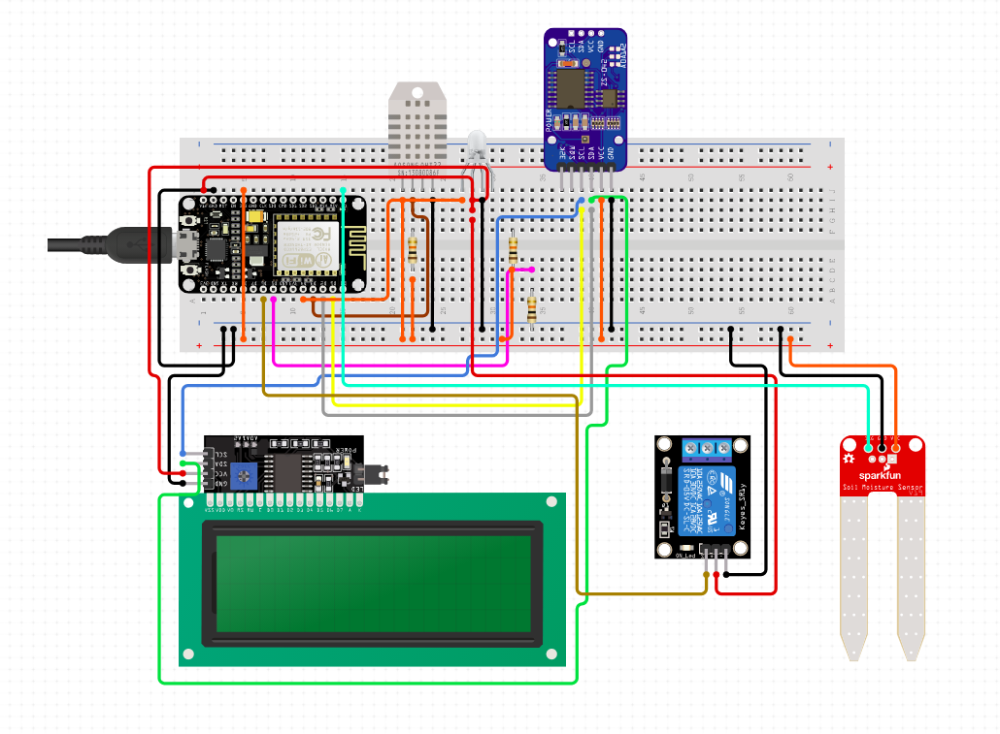
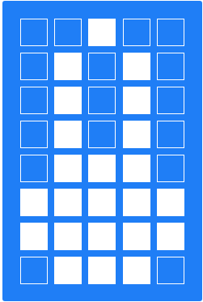
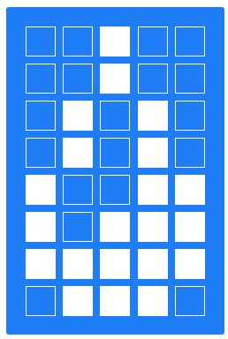

This project is a modification of  Kevin Gagnon's [TaskScheduler](    https://github.com/gadgetstogrow/TaskScheduler)
  

## Planning options

There are many possibilities for planning. Things you can do (e.g.): 

+ Switch the output PIN once for X milliseconds (switched by time)
+ Switch the output PIN once for X milliseconds (switched by e.g. button press)
+ Switch the output PIN periodically 
+ Switch the output PIN once on 31st of October 2020
+ Switch the output PIN once on 31st of October 2020 and repeat every 7 days
...


# TASK

There are several types of tasks (some of them supports RTC, some of them not). RTC is "enabled" by constructor used, you can check if it was used by calling ```isRtcTask()```. 

The task can have a name (might be used for display printout) and have IDs (which are set during the first run). IDs are useful when there are several processed making output to the display at the same time. 

You can set name of the task using ```taskname.setName("testname");```.  


# TaskSheduller 

This is kinda loop that executes all tasks. Tasks are in an array, 

``` c 
Task *tasks[] = {
	&debugger,			// Debugger for other tasks
	&blinker,			// example for turn on - delay - turn off - delay task 
	&onetimeexecute, 	// example for one-time-run task 
	&temperature,				
	&mylcd				// LCD for other tasks
};
``` 

executed one by one (if they are allowed to run). There is not a priority set - it goes from the first task from the array until the last task and over. 


## TimeExecute: TriggeredTimeTask()

There are several options of use. Prepared constructors are: 

| x | DateTime | SimpleClock | SimpleClock delay  |
| --- | :------: |:------:| :------:|
| Pin switching | uint8_t _pin      | uint8_t _pin     |   uint8_t _pin |
| When it turns on | DateTime *_dt_startTime |  (immediately)  | uint32_t _delay |
| How long is turned on | TimeSpan* _dt_activeTime | uint32_t _active_time | uint32_t _active_time |
| Debugger pointer | Debugger *_ptrDebugger | Debugger *_ptrDebugger | Debugger *_ptrDebugger |
| LCD pointer | LCD * _ptr_lcd | LCD * _ptr_lcd | LCD * _ptr_lcd |
| Usage | You want to switch on the device connected to _pin at a specific time (and keep it on during for activeTime), even if something goes wrong with Arduino's power source (time is used from external RTC module) | You want to turn on the device connected to _pin right after Arduino turns and keep it on during for activeTime. It happens every time Arduino "boots"  |  You want to turn on the device connected to _pin with _delay from Arduino's start and keep it on during for activeTime. It happens every time Arduino "boots" |

This kind of function uses 
```     
uint32_t runTime;   // The system clock tick when the task can run.
uint32_t stopTime;  // The system clock tick when the task stops.
uint32_t runNextUpdateTime;    
``` 
(or RTC alternative) 
```
DateTime  dt_runTime; 
DateTime  dt_stopTime; 
TimeSpan  dt_runUpdateTime; 
``` 

to define when the function starts, ends and updates. The most important one is Update because it allows us to print something on display. 

To run this task you **have to set it runnable** ```  taskanme.setRunnable(true);``` or ```taskanme.setRunnable();```. Otherwise it will not start. 

### Periodical run
You can set Periodic run using  
```   
example.setPeriod(uint32_t time_in_miliseconds); // auto enables period
example.setPeriod(TimeSpan ts); // auto enabled period
```
(depends if RTC constructor was used).

If you don't want to disable period, you can use\

```
example.disablePeriod();
```

**Limits: ** If you are using TimeSpan (RTC), the shortest period is 1 second. If you need less, you might want to use/modify class Blinker. 


This
Cílem této semestrální práce je vytvořit kompletní řešení pro automatické zavlažování skleníků. V souvislosti s tím bych chtěl vytvořit/upravit  plánovač, který by byl jednoduše rozšiřitelný a upravitelný a použitelný i v dalších mých projektech. 


## Example setup

Vytvořeno v [Circuit.io ](https://www.circuito.io/static/reply/index.html?solutionId=5eb060397c4b880030747f86&solutionPath=storage.circuito.io)

### list of parts 
+ RTCNodeMCUv1.0 modul 
+ 20X4 dispay connected through I2C
+Temperature and humidity sensor DHT11
+ Rellay module
+ Soil moisture sensor 
+ 2pcs resitor 10kOhm 
+ Push-button 

## What is different from previous versions

Compared to the previous versions (see Credits) there are following features

+ Planning with RTClib (like turn PIN ON on 1.1.2020 at 4:53 PM)
+ As the project grew I decided to separate it to several files
+ You can use Update() function in case you want to write something on the screen when a process is running
+ Added class Button for controlling events e.g. If button long pressed, then run some task. Short press to stop the task.
+ Added class Display (used through the entire project), use to display data and progress bar easily on the screen. This class can be used from various  other classes
+ Special set of chars for 20x4 or 16x2 type of screen (e.g. humidity char, temperature char, wifi char etc.)


# Quickstart

After you download the source code, open ArduinoIDE (install required libraries) and start here: 

There in file *ArduinoTaskScheduler.ino* add/remove/modify tasks. First, you have to create an instance of a class, e.g.

``` c 
		// Blinker blinker(output led pin, period (ms), pointer to debugger)
    Blinker	blinker(D1, 400, &debugger);
                        
```

To keep features like Debug, Display etc. you must not delete its instances. 

Then you have to add the instance's pointer to tasks array. 

```
  Task *tasks[] = {

    &debugger,
    **&blinker,**
    ...
    &mylcd 
  };

``` 
Then just compile and run. 


There are important classes you will probably use in your projects. I just wanted to mention them. You will use them only if the classes I made are not enough. 

### Debugger 

``` c 
// Debugger:  
class Debugger : public Task
{
public:
  Debugger(); 
  void debugWrite(String debugMsg); // Used for simple debugging of other tasks 
(...) 
}
``` 

an LCD 

### LCD 

``` 

You can use some special characters created, like 

|:------:| :------:|
|  |   |

for better orientation on screen. 
 

# Credit section
Original author: Alan Burlison, Copyright Alan Burlison, 2011
+ Original [source code](http://bleaklow.com/files/2010/Task.tar.gz)

+ link to [original project website](http://bleaklow.com/2010/07/20/a_very_simple_arduino_task_manager.html)

Author of the modification from 17.03.2019 which I used in this project is Kevin Gagnon  [github project](https://github.com/gadgetstogrow/TaskScheduler)


## 3rd party libraries used


   CREDIT: other libraries
+ [Adafruit library (DHT sensor)](https://github.com/adafruit/DHT-sensor-library) Licence: MIT
+ [Adafruit library (RTClib)](https://github.com/adafruit/RTClib)  Licence: MIT
+ [Adafruit Unified Sensor (for RTClib)](https://github.com/adafruit/Adafruit_Sensor)  Licence: Apache 2
+ [LiquidCrystal_I2C](https://www.arduinolibraries.info/libraries/liquid-crystal-i2-c) Licence: Unknown
+ class Display: DrawProgressBar inspired by [Arduino Forum](https://forum.arduino.cc/index.php?topic=180678.0)   Licence: Unknown


This list might not be always up to date. Please take a look also to  **ArduinoTaskSheduller.ino**.  If I used your code and forgot to mention, I am deeply sorry. Just feel free to contact me and I'll fix that. Thank you. 


